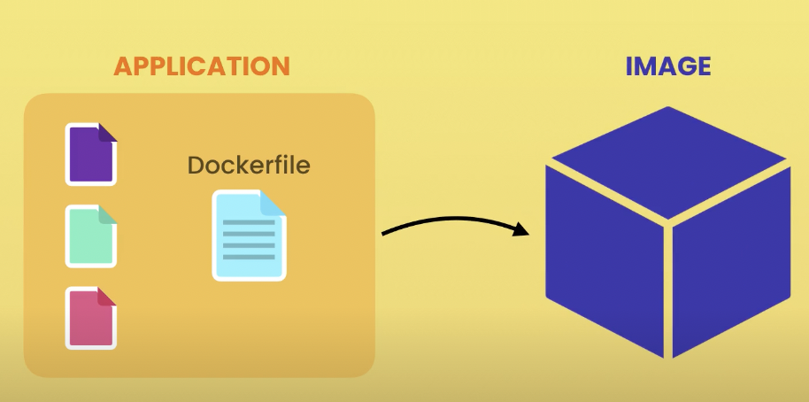

# Introduction to Docker

## Navigation

1. [What is Docker?](#what-is-docker)
1. [Virtual Machines vs Containers](#virtual-machinesvm-vs-containers)
1. [Architecture of Docker](#docker-architecture)
1. [Installing Docker](#installing-docker)
1. [Development workflow](#development-workflow)
1. [Example](#example)

## What is Docker

A platform for building, running and shipping applications. So if your application works on your development machine, it can run and function the same way on other machines.

Why sometimes the app goes wrong?

- One or more files missing
- Software version mismatch
- Different configuration settings

That's why we need Docker, with Docker we can easily `package` our application with everything it needs, and run it anywhere on any machine with Docker.

[BACK TO NAVIGATION](#navigation)

## Virtual Machines(VM) vs Containers

Virtual Machine

> An abstraction of a machine(physical hardware), for example, on Mac we can run Linux in VM with tool we call `Hypervisor`, like `VirtualBox`, `VMware`, or `Hyper-v(Windows only)`

We can run applications in isolation inside the VM.
But it comes a problem:

- Each VM needs a full-blown OS
- Slow to start
- Resource intensive

---

Container

> An isolated environment for running an application

- Allow running multiple apps in isolation
- Are lightweight
- Use OS of the host
- Start quickly
- Need less hardware resources

[BACK TO NAVIGATION](#navigation)

## Docker Architecture

- Docker use `client-server architecture`
  - `Client component` talks to a `Server component` using a RESTful API
  - `Server component` also called the `Docker engine`
  - Docker engine takes care of building and running Docker `containers`
- containers is just a `process`
  - it doesn't contain a full-blown OS. Indtead, all the containers share the kernel of the host
- A kernel manages applications and hardware resources, like `memory`, `CPU`, etc.

[BACK TO NAVIGATION](#navigation)

## Installing Docker

- [Mac: with homebrew](https://formulae.brew.sh/formula/docker)
- [or get docker](https://docs.docker.com/get-docker/)
- My solution: `$ brew install docker --cask`

After it done, `$ docker version` in therminal, it should see the Docker information

[BACK TO NAVIGATION](#navigation)

## Development Workflow



IMAGE contains everything our application needs to run, typically likes:

- A cut-down OS
- A runtime environment (e.g. Node)
- Application files
- Third-party libraries
- Environment variables

Then we can use `$ docker run ...`, that process in an isolate environment

And once we have `IMAGE`, we can push it to a Docker registry like [Docker Hub](https://hub.docker.com/), then we can pull it on any machines running Docker.

e.g.
`Dev machine -push-> Docker hub -pull-> Test/Product machine`

[BACK TO NAVIGATION](#navigation)

## Example

1. Create a project, and inside of the directory create `app.js`
   ```javascript
   // app.js
   console.log("hello docker");
   ```
1. We want to `build`, `run` and `ship` the project using Docker
1. Steps for deploying Node.js project
   1. Start with an OS
   1. Install Node
   1. Copy app files
   1. Run `$ node app.js`
1. What if we working with a really complex application, you will end up with a complex release document that had to be precisel to followed.
1. We can use Docker, and write the release instructions inside a Docker file
1. Add `Dockerfile` in the project root without any extension
   - VS Code extension for docker: [Docker](https://marketplace.visualstudio.com/items?itemName=ms-azuretools.vscode-docker)
1. `Dockerfile` example
   ```dockerfile
   # alpine: which is a very small Linux distribution
   FROM node:alpine
   # we need to copy our application
   # COPY [FROM] [TO]
   COPY . /app
   # Set up the current working directory
   WORKDIR /app
   # Use command instruction to execute the command
   # Without the WORKDIR, the absolute path should be `/app/app.js`
   CMD node app.js
   ```
   - [Reference: node in docker hub](https://hub.docker.com/_/node)
1. Tell Docker to package up our application

   `$ docker build -t hello-docker .`

   - We'll give our image attack a tag to identify, by using `-t`.
   - And specify a name for the image like `hello-docker`
   - Finally specify where Docker can find a Dockerfile `.`

1. After it done, we still can't see the image file in the project folder, because an image is not a single file. How docker stores the image is very complex, we don't have to worry about it.
1. Find out all the images in the current computer in terminal
   `$ docker images`
   or
   `$ docker image ls`
1. We should see information like

   | REPOSITORY   | TAG    | IMAGE ID     | CREATED        | SIZE  |
   | ------------ | ------ | ------------ | -------------- | ----- |
   | hello-docker | latest | 8c2b44953840 | 14 seconds ago | 164MB |

   - Docker add the TAG `latest` by default, and we use this tags for versioning our images, so each image can contain a different version of our application

1. We can run the image on any computer running Docker

   `$ docker run hello-docker`

   - It doesn't matter which directory we're in, because this image contains all the files for running our application.

1. We can upload the image to Docker hub

1. Download it from Docker hub in [play-with-docker](https://labs.play-with-docker.com/), and run it
   - Login in with Docker ID register on Docker hub
   - We can create a vertual machine here with time limit
   - pull the docker image on play-with-docker `$ docker pull the/image/path/on/docker/hub`

[BACK TO NAVIGATION](#navigation)
